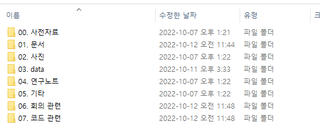

# 폴더 정리 예시
--------

| 폴더 구분 | 설명 | 넘버링 및 예시 |
| ---- | ---- | ---- |
| 시작 폴더 | 모든 폴더들의 루트에 해당 | 회사 |
| | | 이재성 등 |
| 최상위 폴더 | 대분류에 속하는 최상위 폴더로 폴더명을 보면 어떤 프로젝트의 폴더인지 알아볼 수 있게 작성 | 001. 갑상선 인공지능 모델 |
| | | 002. 배아 선별 알고리즘 등 |
| 상위 폴더 | 중분류에 속하는 상위 폴더 |  01. 문서 |
| | | 02. 코드 |
| | | 03. 회의록 등 |
| 일반 폴더 | 상위 폴더를 통해 분류를 나눠진 이후에도 개인 작업 영역이나 월,분기,연도 등으로 나뉠 때 사용 | 01. 2022_10
| | | 02. 이재성_주피터_파일_폴더
| | | 03. 학습자료 모음


> 넘버링 구분 
>> 시작폴더 : 없음
>>
>> 최상위 폴더 : 000 ~ 999 (3자리)
>> 
>> 
>> 
>> 상위 폴더 이하 : 00 ~ 99 (2자리)
>> 
>> 
>
>
> 첫번째 자리 넘버링 구분 예시
>> 0XX : 회사 프로젝트 폴더
>>
>> 1XX : 회사 서버 및 보안 관련
>>
>> 2XX : 문서 작령 요령 및 문서 양식 모음 관련
>>
>> 3XX : 기타 파일 폴더
>
> 파일 구분
>> 문서 : .pdf .doc .docx, .hwp 등
>> 
>> 코드 : .py .ipynb .c .java 등
>> 
>> 데이터 : .jpg .jpeg .png .cmp .csv 등
>>
>> 메모장 : .txt .md 등 (메모장의 경우 공용 폴더 내에서 사용할 경우 필수가 아니면 문서로 변환 권장)
>>
>> 
>>

-----
# 메모장 정리 예시
- 주로 자주 사용하고 매일 키는 메모장을 가리키며 스스로 기억해야 할 사항이나 회의 시간 등을 작성

---
## 주간 요약 메모 예시

```
월 : [엘티포 주간 회의]

화 : [공휴일]

수 : ...

목 : [갑상선 비대면 회의]

금 : ...
```
> 고정 사항이나 공휴일 등은 [] 등을 통해 표기

---
## 개인 기록 사항
- 매일 출근하면서 보는 텍스트 작성
  - 본인만의 좌우명이나 글귀를 써놓거나 목표를 적는 것도 좋습니다
  - 또는 외부에서 원격 접속시 확인 사항을 빠르게 요약하여 정리
- 자주 찾는 특정 텍스트나 파일 경로 등의 텍스트를 작성해놓고 메모장을 통해 복붙용으로 작성
  - 특정 링크나 특정 파일의 경로 등을 작성해놓고 나중에 정리.

```
글귀 (예시)
!!월급 25일!!

서버 X호 (예시)
IP XXX.XXX.XXX.XXX
ID XXXXX
PASSWORD XXXXXX
PORT XX

아래 경로 확인 필요(예시)
/root/home/2022/10/jaeseong/

```

